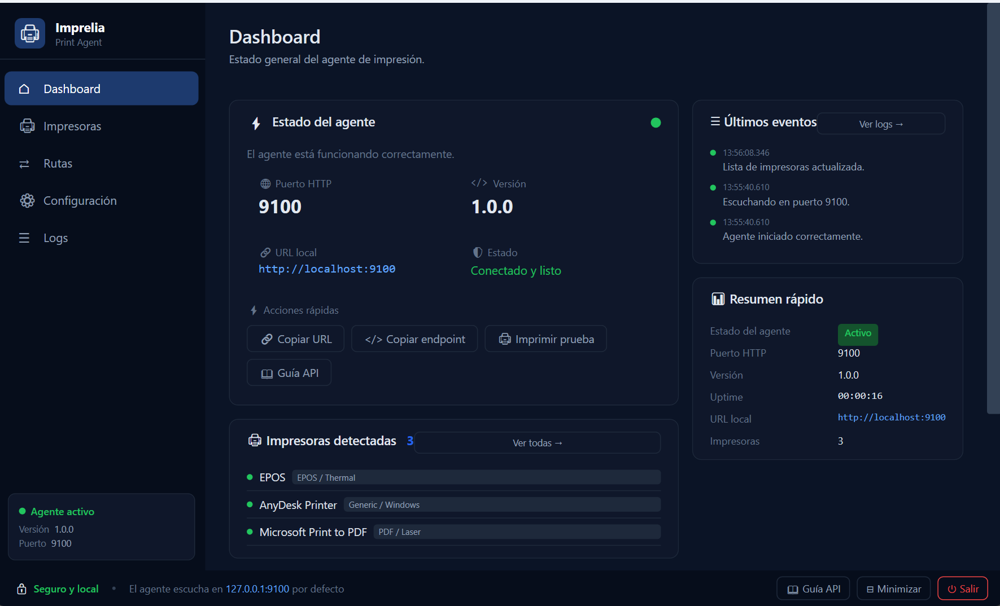
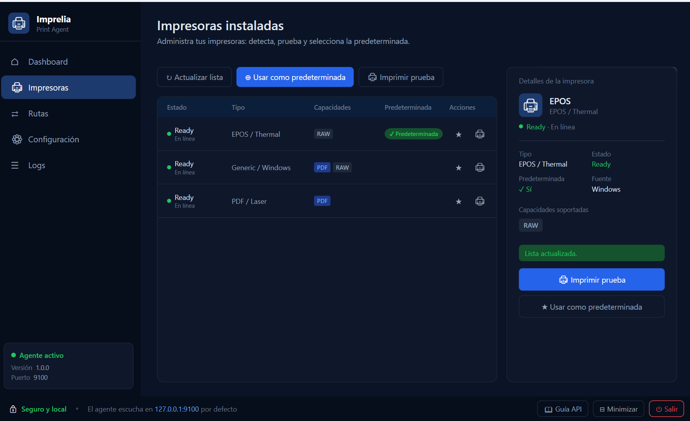
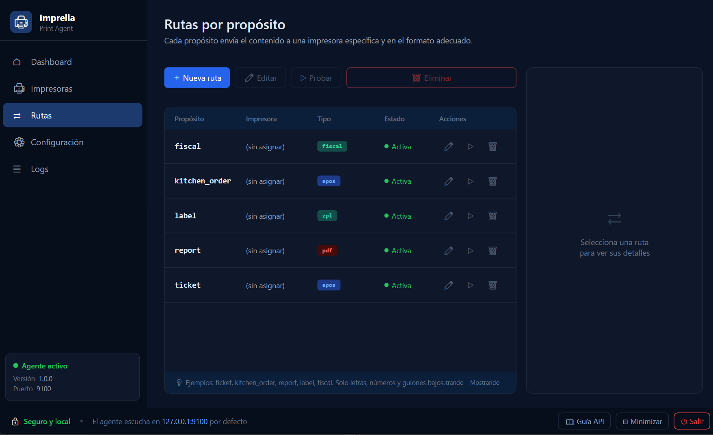
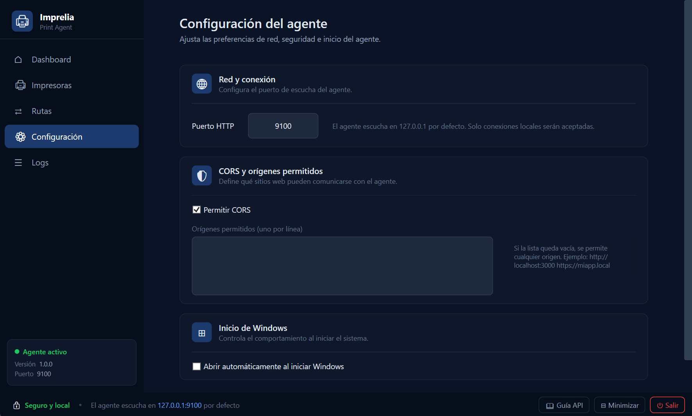
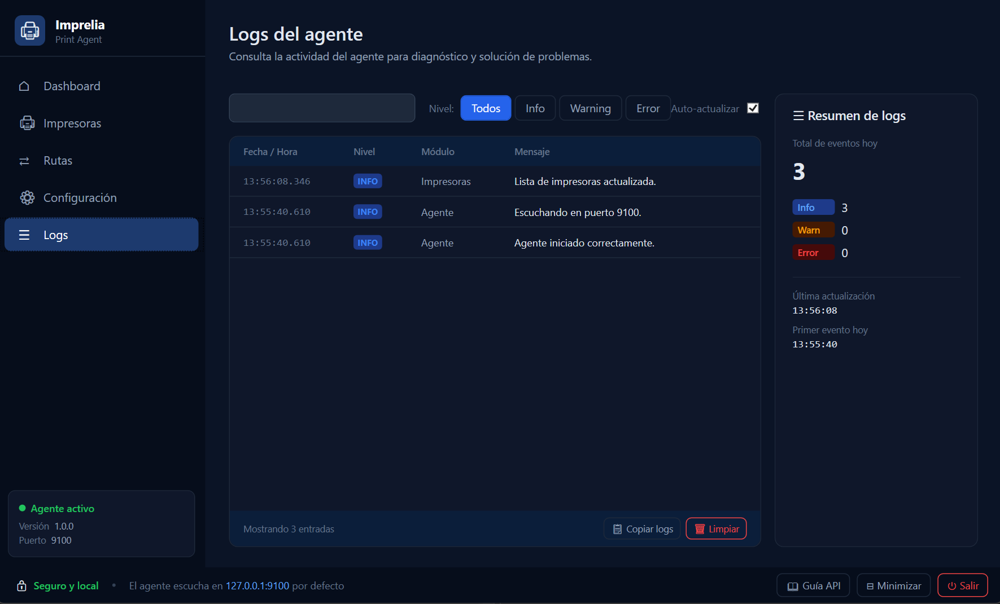

<p align="center">
  
</p>

<h1 align="center">Imprelia Print Agent</h1>

<p align="center">
  Local Windows print agent for web applications. Print to ESC/POS, RAW, TSPL/ZPL/EPL/DPL, PDF-capable and Windows printers through a localhost HTTP API.
</p>

<p align="center">
  <a href="https://github.com/RoberthDudiver/imprelia-print-agent/actions/workflows/dotnet.yml"></a>
  
  
  
</p>

<p align="center">
  <a href="#english">English</a> ·
  <a href="#español">Español</a> ·
  <a href="#screenshots--capturas">Screenshots</a> ·
  <a href="docs/API.md">API</a> ·
  <a href="docs/INSTALLATION.md">Installation</a> ·
  <a href="docs/STORE_SUBMISSION.md">Store</a> ·
  <a href="LICENSE.md">License</a>
</p>

---

## Screenshots · Capturas

A modern WPF interface with a dark theme. Five sections: Dashboard, Printers, Routes, Settings, and Logs.

### Dashboard

Agent status at a glance: HTTP port, version, local URL, uptime, detected printers, configured routes, and recent events.

<p align="center">
  
</p>

### Impresoras · Printers

Detected Windows printers with status, type, capabilities (PDF / RAW / label commands), and the default selector. Print a test page from the detail panel.

<p align="center">
  
</p>

### Rutas · Routes

Map a purpose (`ticket`, `kitchen_order`, `report`, `label`, `fiscal`) to a printer and content type. Web apps print by purpose without knowing the physical printer.

<p align="center">
  
</p>

### Configuración · Settings

Network and security preferences: HTTP port, CORS and allowed origins, and Windows startup behavior.

<p align="center">
  
</p>

### Logs

Real-time agent activity for diagnostics: filter by level (Info / Warning / Error), search, auto-refresh, and a daily summary.

<p align="center">
  
</p>

---

## English

**Imprelia Print Agent** is a Windows tray application that allows web apps to print locally without exposing printers directly to the network. It listens on `127.0.0.1` by default and provides backward-compatible legacy endpoints plus a modern `/api` surface for multi-printer workflows.

Created by **Roberth Dudiver** · [dudiver.net](https://dudiver.net)

### Highlights

- Windows tray app with local settings panel.
- Local HTTP API on `http://localhost:9100`.
- Scalar API guide at `http://localhost:9100/docs`.
- OpenAPI document at `http://localhost:9100/openapi.json`.
- Backward-compatible legacy EPOS/RAW API.
- Printer discovery from Windows installed printers.
- Print by explicit printer name or by configured purpose.
- Supports `epos`, `raw`, `text`, `pdf`, `zpl`, `tspl`, `epl`, `dpl`, and `fiscal` contracts.
- Configurable port, CORS origins, routes, default printer, and optional API key.
- Modern WPF + MVVM interface with a dark theme.
- **Optional [Remote Print Bridge](docs/REMOTE_PRINT_BRIDGE.md)**: a backend can push print jobs to the agent over an outbound secure connection (no public ports) via the [`Imprelia.Server`](Imprelia.Server) NuGet package.

### Quick Start

```powershell
git clone https://github.com/RoberthDudiver/imprelia-print-agent.git
cd imprelia-print-agent
dotnet build .\GastroManager.PrintAgent.sln
dotnet run --project .\Imprelia.PrintAgent.csproj
```

Open:

```text
http://localhost:9100/docs
```

### Example

```http
POST /api/print/by-purpose
Content-Type: application/json
```

```json
{
  "purpose": "ticket",
  "jobName": "Ticket #123",
  "contentType": "epos",
  "content": "base64-or-plain-content",
  "copies": 1
}
```

### Documentation

- [Installation and build](docs/INSTALLATION.md)
- [API reference and examples](docs/API.md)
- [Remote Print Bridge (print from a backend)](docs/REMOTE_PRINT_BRIDGE.md)
- [Architecture](docs/ARCHITECTURE.md)
- [Microsoft Store submission](docs/STORE_SUBMISSION.md)
- [Security policy](SECURITY.md)
- [Contributing guide](CONTRIBUTING.md)
- [Changelog](CHANGELOG.md)

### Build the v1 MSI Installer

```powershell
dotnet build .\installer\Imprelia.PrintAgent.Installer.wixproj -c Release -p:ProductVersion=1.0.0
```

### License Summary

You may use and modify the code. Improvements must be submitted as Pull Requests. You may not sell it or use it commercially without permission. Logos and visual assets may identify this project and compatible builds, but not unauthorized commercial products.

See [LICENSE.md](LICENSE.md).

---

## Español

**Imprelia Print Agent** es una aplicación de bandeja para Windows que permite a aplicaciones web imprimir localmente sin exponer las impresoras directamente a la red. Escucha en `127.0.0.1` por defecto y ofrece endpoints legacy compatibles más una API moderna bajo `/api` para flujos con múltiples impresoras.

Creado por **Roberth Dudiver** · [dudiver.net](https://dudiver.net)

### Puntos principales

- Aplicación Windows con icono en bandeja y panel de configuración.
- API HTTP local en `http://localhost:9100`.
- Guía API con Scalar en `http://localhost:9100/docs`.
- OpenAPI JSON en `http://localhost:9100/openapi.json`.
- API legacy EPOS/RAW compatible hacia atrás.
- Detección de impresoras instaladas en Windows.
- Impresión por impresora explícita o por propósito configurado.
- Contratos para `epos`, `raw`, `text`, `pdf`, `zpl`, `tspl`, `epl`, `dpl` y `fiscal`.
- Puerto, CORS, orígenes, rutas, impresora default y API key opcional configurables.
- Interfaz moderna en WPF + MVVM con tema oscuro.
- **[Puente de impresión remota](docs/REMOTE_PRINT_BRIDGE.md) opcional**: un backend puede empujar trabajos al agente por una conexión saliente segura (sin puertos públicos) usando el paquete NuGet [`Imprelia.Server`](Imprelia.Server).

### Inicio rápido

```powershell
git clone https://github.com/RoberthDudiver/imprelia-print-agent.git
cd imprelia-print-agent
dotnet build .\GastroManager.PrintAgent.sln
dotnet run --project .\Imprelia.PrintAgent.csproj
```

Abre:

```text
http://localhost:9100/docs
```

### Ejemplo

```http
POST /api/print/by-purpose
Content-Type: application/json
```

```json
{
  "purpose": "ticket",
  "jobName": "Ticket #123",
  "contentType": "epos",
  "content": "base64-o-contenido-plano",
  "copies": 1
}
```

### Documentación

- [Instalación y compilación](docs/INSTALLATION.md)
- [Referencia API y ejemplos](docs/API.md)
- [Puente de impresión remota (imprimir desde un backend)](docs/REMOTE_PRINT_BRIDGE.md)
- [Arquitectura](docs/ARCHITECTURE.md)
- [Publicación en Microsoft Store](docs/STORE_SUBMISSION.md)
- [Política de seguridad](SECURITY.md)
- [Guía para contribuir](CONTRIBUTING.md)
- [Historial de cambios](CHANGELOG.md)

### Generar instalador MSI v1

```powershell
dotnet build .\installer\Imprelia.PrintAgent.Installer.wixproj -c Release -p:ProductVersion=1.0.0
```

### Resumen de licencia

Puedes usar y modificar el código. Las mejoras deben enviarse como Pull Requests. No puedes venderlo ni usarlo comercialmente sin permiso. Los logos y recursos visuales pueden identificar este proyecto y builds compatibles, pero no productos comerciales no autorizados.

Ver [LICENSE.md](LICENSE.md).
