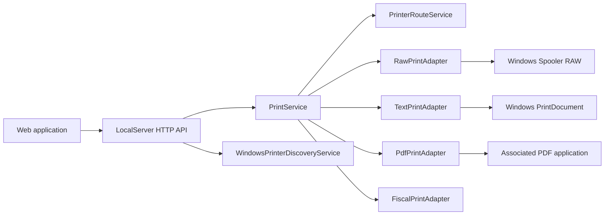

# Architecture

## English

Imprelia Print Agent is intentionally small and adapter-oriented. The local HTTP server receives requests, resolves the target printer, and delegates actual printing to content-specific adapters.

### Main Components

- `Program`: tray application entry point.
- `SettingsForm`: WinForms settings UI.
- `LocalServer`: localhost HTTP API.
- `AppConfig`: persisted configuration.
- `WindowsPrinterDiscoveryService`: installed printer discovery.
- `PrintService`: central print dispatcher.
- `IPrintAdapter`: adapter contract.
- `RawPrintAdapter`: `epos`, `raw`, `zpl`, `tspl`, `epl`, and `dpl`.
- `TextPrintAdapter`: text through Windows printing.
- `PdfPrintAdapter`: PDF handoff through Windows shell association.
- `FiscalPrintAdapter`: explicit placeholder until fiscal drivers are configured.
- `JobHistoryService`: recent in-memory jobs.

### Extension Points

Add a new printer/content backend by implementing `IPrintAdapter` and registering it in `PrintService`.

Recommended adapter responsibilities:

- Validate content.
- Convert content to printable bytes/documents.
- Return clear `PrintResponse` errors.
- Avoid changing legacy endpoints.

---

## Español

Imprelia Print Agent es pequeño y orientado a adaptadores. El servidor HTTP local recibe requests, resuelve la impresora destino y delega la impresión real a adaptadores según el tipo de contenido.

### Componentes principales

- `Program`: punto de entrada de la app en bandeja.
- `SettingsForm`: UI WinForms de configuración.
- `LocalServer`: API HTTP local.
- `AppConfig`: configuración persistente.
- `WindowsPrinterDiscoveryService`: detección de impresoras instaladas.
- `PrintService`: despachador central.
- `IPrintAdapter`: contrato de adaptadores.
- `RawPrintAdapter`: `epos`, `raw`, `zpl`, `tspl`, `epl` y `dpl`.
- `TextPrintAdapter`: texto vía impresión Windows.
- `PdfPrintAdapter`: PDF vía asociación de Windows.
- `FiscalPrintAdapter`: placeholder explícito hasta configurar drivers fiscales.
- `JobHistoryService`: trabajos recientes en memoria.

### Puntos de extensión

Para agregar un nuevo backend de impresión o tipo de contenido, implementa `IPrintAdapter` y regístralo en `PrintService`.

Responsabilidades recomendadas:

- Validar contenido.
- Convertir contenido a bytes/documentos imprimibles.
- Devolver errores claros con `PrintResponse`.
- No romper endpoints legacy.
